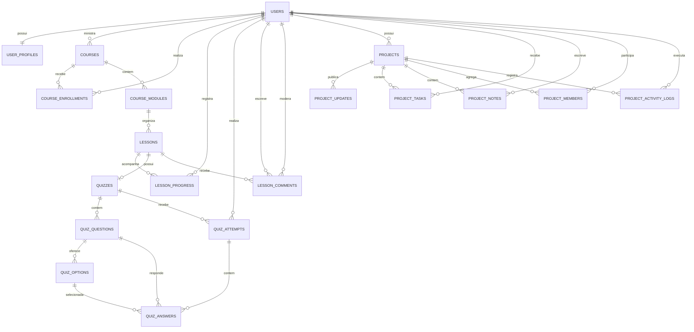

# Modelagem de dados — DevNest

> Documento de apoio para revisar a modelagem atual do backend. Ele reflete as migrations `V1` a `V6` e as entidades JPA existentes em 20/07/2026.

## Visão geral

O banco está dividido em três contextos principais:

- **Identidade:** usuários, perfis, papéis e status de acesso.
- **Aprendizado:** cursos, módulos, aulas, matrículas, progresso, quizzes e comentários.
- **Projetos:** projetos, membros, tarefas, notas, atualizações e histórico de atividades.

Todas as entidades usam `UUID` como chave primária e, por meio de `BaseEntity`, possuem `created_at` e `updated_at` do tipo `timestamptz`.

## Diagrama entidade-relacionamento

## 1. Identidade

### `users`

Conta central usada pelos demais contextos.

| Campo | Tipo | Regra |
|---|---|---|
| `id` | UUID | PK |
| `email` | varchar(320) | obrigatório e único |
| `password_hash` | varchar(255) | obrigatório |
| `role` | varchar(20) | `ADMIN`, `STUDENT` ou `TEACHER` |
| `status` | varchar(20) | `ACTIVE`, `BLOCKED` ou `DELETED` |
| `token_version` | integer | obrigatório, padrão `0`; invalida tokens antigos |

### `user_profiles`

Dados públicos opcionais da conta. Relação 1:1 com `users`.

| Campo | Tipo | Regra |
|---|---|---|
| `user_id` | UUID | FK para `users`, obrigatório e único |
| `display_name` | varchar(80) | obrigatório |
| `full_name` | varchar(120) | opcional |
| `bio` | text | opcional |
| `avatar_url` | varchar(255) | opcional |
| `github_url` | varchar(255) | opcional |
| `linkedin_url` | varchar(255) | opcional |
| `portfolio_url` | varchar(255) | opcional |
| `location` | varchar(120) | opcional |

## 2. Cursos e aprendizado

### Estrutura de conteúdo

`courses` → `course_modules` → `lessons` → `quizzes` → `quiz_questions` → `quiz_options`

### `courses`

| Campo | Tipo | Regra |
|---|---|---|
| `teacher_id` | UUID | FK para `users`, obrigatório |
| `title` | varchar(160) | obrigatório |
| `description` | text | opcional |
| `level` | varchar(40) | opcional e sem enum no banco |
| `cover_image_url` | varchar(500) | opcional |
| `status` | varchar(20) | `DRAFT`, `PUBLISHED` ou `ARCHIVED` |
| `archived` | boolean | obrigatório, padrão `false` |

### `course_modules`

| Campo | Tipo | Regra |
|---|---|---|
| `course_id` | UUID | FK para `courses`, obrigatório |
| `title` | varchar(160) | obrigatório |
| `description` | text | opcional |
| `position` | integer | obrigatório; único dentro do curso |

Restrição única: `(course_id, position)`.

### `lessons`

| Campo | Tipo | Regra |
|---|---|---|
| `module_id` | UUID | FK para `course_modules`, obrigatório |
| `title` | varchar(160) | obrigatório |
| `description` | text | opcional |
| `content` | text | opcional |
| `video_url` | varchar(255) | opcional |
| `position` | integer | obrigatório; único dentro do módulo |

Restrição única: `(module_id, position)`.

### Matrícula e progresso

#### `course_enrollments`

Liga estudantes a cursos.

| Campo | Tipo | Regra |
|---|---|---|
| `student_id` | UUID | FK para `users`, obrigatório |
| `course_id` | UUID | FK para `courses`, obrigatório |
| `status` | varchar(20) | `ACTIVE`, `COMPLETED` ou `CANCELLED` |
| `enrolled_at` | timestamptz | obrigatório |
| `completed_at` | timestamptz | opcional |

Restrição única: `(student_id, course_id)`.

#### `lesson_progress`

| Campo | Tipo | Regra |
|---|---|---|
| `student_id` | UUID | FK para `users`, obrigatório |
| `lesson_id` | UUID | FK para `lessons`, obrigatório |
| `completed` | boolean | obrigatório |
| `completed_at` | timestamptz | opcional |

Restrição única: `(student_id, lesson_id)`.

### Quiz

#### `quizzes`

Cada aula pode ter no máximo um quiz.

| Campo | Tipo | Regra |
|---|---|---|
| `lesson_id` | UUID | FK para `lessons`, obrigatório e único |
| `title` | varchar(160) | obrigatório |
| `passing_score` | integer | entre `0` e `100`; padrão `70` |
| `max_attempts` | integer | entre `1` e `10`; padrão `3` |
| `max_questions` | integer | entre `1` e `50`; padrão `10` |

#### `quiz_questions`

| Campo | Tipo | Regra |
|---|---|---|
| `quiz_id` | UUID | FK para `quizzes`, obrigatório |
| `statement` | text | obrigatório |
| `position` | integer | atualmente limitada entre `1` e `10` |

Restrição única: `(quiz_id, position)`.

#### `quiz_options`

| Campo | Tipo | Regra |
|---|---|---|
| `question_id` | UUID | FK para `quiz_questions`, obrigatório |
| `text` | text | obrigatório |
| `is_correct` | boolean | obrigatório |
| `position` | integer | obrigatório e único dentro da questão |

Restrição única: `(question_id, position)`.

#### `quiz_attempts`

| Campo | Tipo | Regra |
|---|---|---|
| `quiz_id` | UUID | FK para `quizzes`, obrigatório |
| `student_id` | UUID | FK para `users`, obrigatório |
| `attempt_number` | integer | atualmente limitado entre `1` e `3` |
| `score` | integer | entre `0` e `100` |
| `passed` | boolean | obrigatório |

Restrição única: `(student_id, quiz_id, attempt_number)`.

#### `quiz_answers`

| Campo | Tipo | Regra |
|---|---|---|
| `attempt_id` | UUID | FK para `quiz_attempts`, obrigatório |
| `question_id` | UUID | FK para `quiz_questions`, obrigatório |
| `selected_option_id` | UUID | FK para `quiz_options`, obrigatório |
| `correct` | boolean | resultado persistido |

Restrição única: `(attempt_id, question_id)`.

### `lesson_comments`

Comentários e avaliações deixados por estudantes nas aulas.

| Campo | Tipo | Regra |
|---|---|---|
| `lesson_id` | UUID | FK para `lessons`, obrigatório |
| `student_id` | UUID | FK para `users`, obrigatório |
| `content` | text | obrigatório |
| `rating` | integer | entre `1` e `10` |
| `status` | varchar(30) | estado da moderação |
| `hidden` | boolean | obrigatório, padrão `false` |
| `moderation_reason` | varchar(255) | opcional |
| `removed_by` | UUID | FK opcional para `users` |
| `removed_at` | timestamptz | opcional |

Status possíveis: `VISIBLE`, `HIDDEN_BY_FILTER`, `REMOVED_BY_TEACHER` e `REMOVED_BY_ADMIN`.

## 3. Projetos

### `projects`

| Campo | Tipo | Regra |
|---|---|---|
| `owner_id` | UUID | FK para `users`, obrigatório |
| `title` | varchar(160) | obrigatório |
| `description` | text | opcional |
| `status` | varchar(20) | `PLANNING`, `IN_PROGRESS`, `PAUSED` ou `COMPLETED` |
| `visibility` | varchar(20) | `PUBLIC` ou `PRIVATE` |

### `project_updates`

Publicações de progresso do projeto.

| Campo | Tipo | Regra |
|---|---|---|
| `project_id` | UUID | FK para `projects`, obrigatório |
| `title` | varchar(160) | obrigatório |
| `content` | text | obrigatório |

### `project_tasks`

| Campo | Tipo | Regra |
|---|---|---|
| `project_id` | UUID | FK para `projects`, obrigatório, cascade delete |
| `title` | varchar(160) | obrigatório |
| `description` | text | opcional |
| `status` | varchar(20) | `TODO`, `IN_PROGRESS` ou `DONE` |
| `priority` | varchar(20) | `LOW`, `MEDIUM` ou `HIGH` |
| `assigned_to_id` | UUID | FK opcional para `users` |
| `due_date` | date | opcional |

### `project_notes`

| Campo | Tipo | Regra |
|---|---|---|
| `project_id` | UUID | FK para `projects`, obrigatório, cascade delete |
| `author_id` | UUID | FK para `users`, obrigatório |
| `content` | text | obrigatório |

### `project_members`

| Campo | Tipo | Regra |
|---|---|---|
| `project_id` | UUID | FK para `projects`, obrigatório, cascade delete |
| `user_id` | UUID | FK para `users`, obrigatório |
| `role` | varchar(20) | `OWNER`, `ADMIN`, `MEMBER` ou `VIEWER` |

Restrição única: `(project_id, user_id)`.

### `project_activity_logs`

Trilha de auditoria funcional do projeto.

| Campo | Tipo | Regra |
|---|---|---|
| `project_id` | UUID | FK para `projects`, obrigatório, cascade delete |
| `actor_id` | UUID | FK para `users`, obrigatório |
| `type` | varchar(40) | enum definido na aplicação |
| `message` | varchar(255) | obrigatório |

## Regras e decisões importantes

- Um e-mail identifica uma única conta.
- Uma conta possui no máximo um perfil.
- Um professor pode possuir vários cursos.
- Um estudante só pode ter uma matrícula por curso.
- A posição de módulos, aulas, questões e opções é ordenada e não pode se repetir no respectivo pai.
- Uma aula possui no máximo um quiz.
- Uma tentativa possui no máximo uma resposta por questão.
- Um usuário só pode aparecer uma vez como membro de cada projeto.
- Ao apagar um projeto, tarefas, notas, membros e logs são apagados em cascata no banco.
- Na entidade JPA, atualizações do projeto também usam cascade/orphan removal, embora a FK criada em `V1` não declare `ON DELETE CASCADE`.

## Pontos para averiguar

- [ ] **Limites de quiz desalinhados:** a migration `V6` permite até 10 tentativas e 50 questões, mas `quiz_attempts.attempt_number` continua limitado a `1..3` e `quiz_questions.position` a `1..10`.
- [ ] **Arquivamento duplicado em curso:** existem `status = ARCHIVED` e o booleano `archived`. Definir uma fonte única de verdade ou documentar por que ambos são necessários.
- [ ] **Moderação duplicada em comentário:** existem `status` e `hidden`. Eles podem divergir; vale estabelecer uma regra explícita.
- [ ] **Integridade das respostas:** o banco não garante que a opção selecionada pertence à questão registrada na resposta.
- [ ] **Integridade das tarefas:** o banco não garante que `assigned_to_id` seja membro do projeto da tarefa.
- [ ] **Integridade acadêmica:** o banco não garante que usuários ligados como professor/estudante tenham os respectivos papéis.
- [ ] **Matrícula antes do progresso:** não há FK/regra garantindo que quem registra progresso, tentativa ou comentário esteja matriculado no curso.
- [ ] **Exclusões:** quase todas as FKs do contexto de cursos não possuem estratégia explícita de `ON DELETE`; definir se exclusão deve ser bloqueada, lógica ou em cascata.
- [ ] **Índices:** avaliar índices nas FKs e filtros frequentes (`teacher_id`, `course_id`, `student_id`, `project_id`, status e datas).
- [ ] **Dono duplicado:** o projeto tem `owner_id` e pode também ter um membro com papel `OWNER`; manter os dois sincronizados é regra da aplicação.
- [ ] **Histórico de updates:** `project_updates` não guarda explicitamente o autor da publicação.
- [ ] **Auditoria de logs:** apagar o projeto apaga seus logs; decidir se a auditoria deveria sobreviver à exclusão.

## Legenda

- **PK:** chave primária.
- **FK:** chave estrangeira.
- **1:1:** um registro se relaciona com no máximo um do outro lado.
- **1:N:** um registro pode se relacionar com vários do outro lado.
- **Cascade delete:** registros dependentes são apagados junto com o registro pai.

